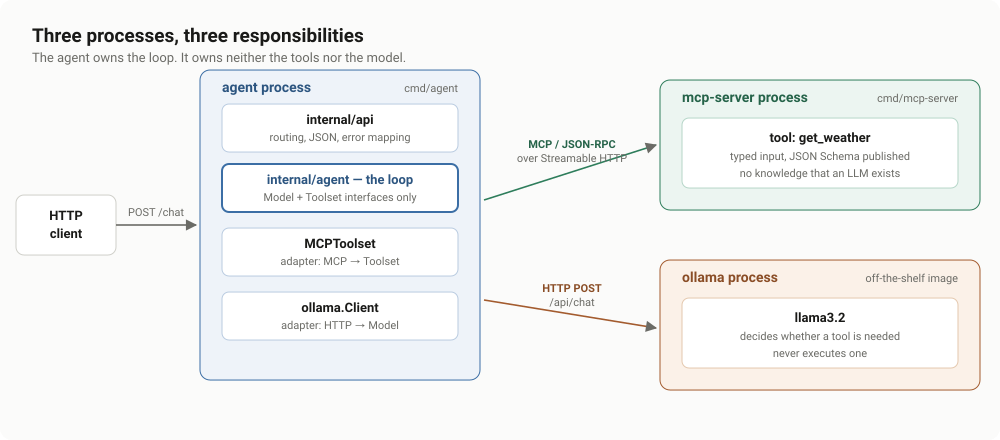
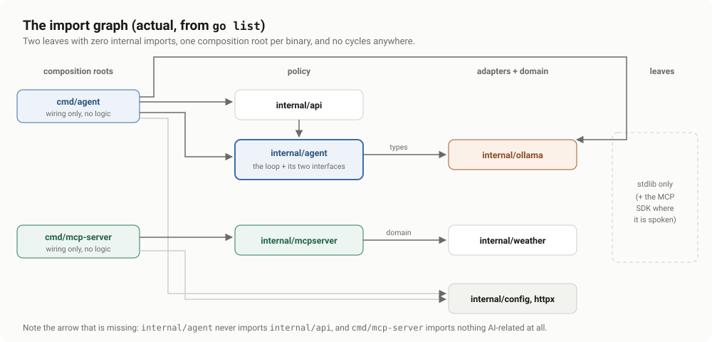
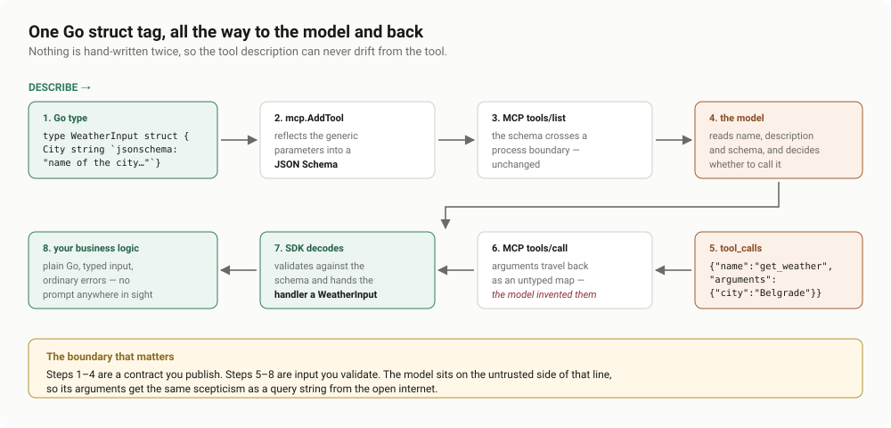
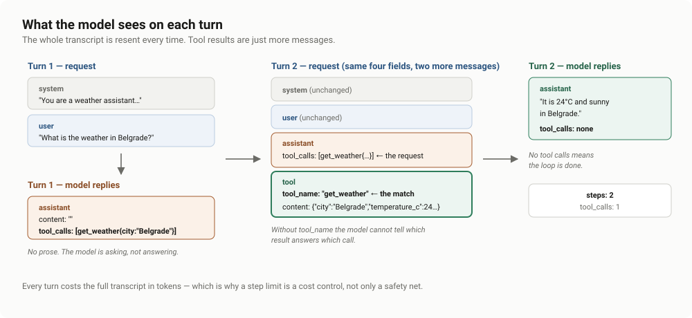
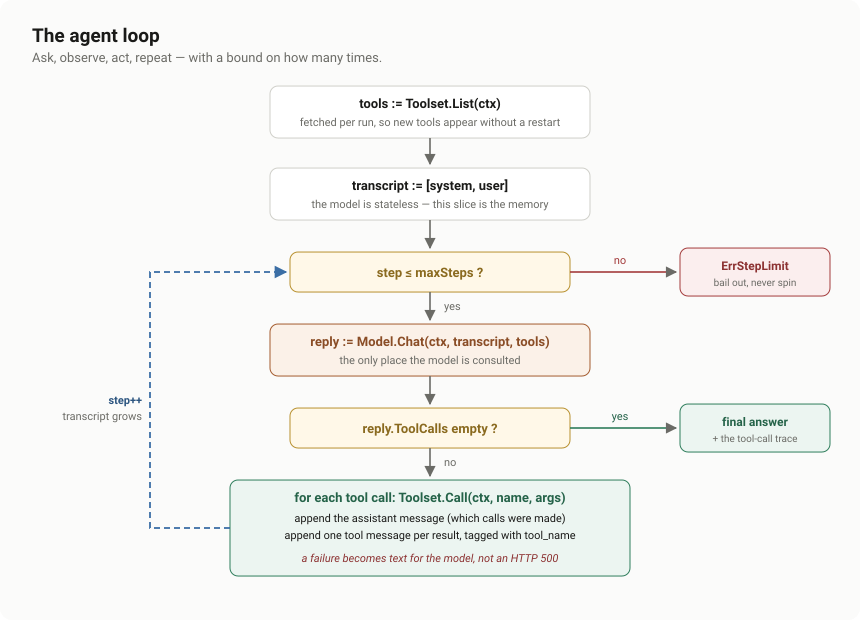

# Building an AI Agent in Go: Tool Orchestration with MCP and a Local LLM

*A step-by-step walkthrough of a small, production-shaped Go service in which a language model decides which tools to call, and the tools live in a process that has never heard of a language model.*

---

**What this article covers.** How to build an AI agent from first principles in Go: the wire format of a tool-calling model, how to publish a tool over the Model Context Protocol, the agent loop itself, and the operational scaffolding — timeouts, graceful shutdown, structured logging, tests with no model in sight — that separates a demo from a service.

**What it deliberately does not cover.** Prompt engineering tricks, RAG, vector databases, or framework comparisons. The reference implementation is about 700 lines of Go with one third-party dependency, and every line is here to make one of the four core mechanics legible.

**Reference implementation.** [`simple-AI-orchestration-service`](../README.md) — Go 1.26, the standard library, and the official [MCP Go SDK](https://github.com/modelcontextprotocol/go-sdk).

---

## Table of contents

1. [The problem: a language model cannot do anything](#1-the-problem-a-language-model-cannot-do-anything)
2. [Why MCP, and why a separate process](#2-why-mcp-and-why-a-separate-process)
3. [Step 1 — Model the wire format](#3-step-1--model-the-wire-format)
4. [Step 2 — Define a tool the model can understand](#4-step-2--define-a-tool-the-model-can-understand)
5. [Step 3 — Two interfaces that make an agent testable](#5-step-3--two-interfaces-that-make-an-agent-testable)
6. [Step 4 — The agent loop](#6-step-4--the-agent-loop)
7. [Step 5 — Turn it into a service](#7-step-5--turn-it-into-a-service)
8. [Step 6 — Testing an agent with no model and no network](#8-step-6--testing-an-agent-with-no-model-and-no-network)
9. [Step 7 — Ship it](#9-step-7--ship-it)
10. [Seeing it run](#10-seeing-it-run)
11. [Design decisions and trade-offs](#11-design-decisions-and-trade-offs)
12. [What production would add](#12-what-production-would-add)
13. [Appendix: the Go techniques used, and why](#13-appendix-the-go-techniques-used-and-why)

---

## 1. The problem: a language model cannot do anything

A language model maps tokens to tokens. It cannot read a database, call an API, or check today's weather. Everything an "AI agent" appears to *do* happens because ordinary software did it, and the only thing the model contributed was the decision that it should be done.

That single sentence determines the architecture. There are three distinct responsibilities, and conflating any two of them is the mistake most first implementations make:

| Role | Responsibility | What it must **not** do |
|---|---|---|
| **The model** | Decide *whether* and *with what arguments* a tool should run | Execute anything |
| **The tool server** | Execute one well-defined operation over validated input | Know that a model exists |
| **The agent** | Mediate: advertise tools, relay decisions, feed results back | Contain business logic |

The agent is not the model. The agent is the *loop* around the model. That loop is perhaps forty lines of Go, and getting those forty lines right is most of the work.



The reference implementation makes that separation physical — three processes, each replaceable:

```text
cmd/agent/            the loop, exposed over HTTP
cmd/mcp-server/       the tools, exposed over MCP
ollama                the model, an off-the-shelf container
```

---

## 2. Why MCP, and why a separate process

Before the [Model Context Protocol](https://modelcontextprotocol.io), every application that wanted tool use re-declared its tools inline: a JSON Schema literal next to a `switch` statement on the tool name. That works exactly once. The tools are welded to one application, one model vendor, and one deployment.

MCP is the contract that breaks the weld. A tool server publishes typed, self-describing tools over JSON-RPC; any MCP client — your agent, Claude Desktop, an IDE, a colleague's Python service — discovers and calls them without a line of shared code.

The design pressure this creates is healthy, and it is worth stating as a rule:

> **If your tool server imports anything AI-related, the abstraction has already leaked.**

That is a claim you can verify mechanically rather than assert. Here is the real import graph of the reference implementation, from `go list`:

```console
$ go list -f '{{range .Imports}}{{.}}{{"\n"}}{{end}}' ./cmd/mcp-server | grep simple-AI
github.com/nikolacuricdev/simple-AI-orchestration-service/internal/config
github.com/nikolacuricdev/simple-AI-orchestration-service/internal/httpx
github.com/nikolacuricdev/simple-AI-orchestration-service/internal/mcpserver
```

No `internal/agent`. No `internal/ollama`. No prompt, no model client, no token budget. The tool server is a plain Go HTTP service that happens to speak MCP.



The arrows all point one way, and the two leaf packages — `internal/ollama` and `internal/weather` — import nothing from the project at all. That is not architectural decoration; it is what makes the loop testable in section 8.

---

## 3. Step 1 — Model the wire format

Start at the bottom. Before there is an agent, there has to be a typed conversation with the model.

Ollama's `/api/chat` uses the same message-and-tool-call shape as most chat completion APIs, so these four types are a fair map of the domain generally.

```go
// Message is one entry in the conversation sent to the model.
//
// The whole conversation is resent on every call: the model is stateless, so
// the transcript the agent builds up *is* the memory.
type Message struct {
	Role    string `json:"role"`
	Content string `json:"content,omitempty"`

	// ToolCalls is set by the model on an assistant message when it wants a
	// tool run before it can answer.
	ToolCalls []ToolCall `json:"tool_calls,omitempty"`

	// ToolName is set by us on a RoleTool message to say which tool produced
	// Content. Without it the model cannot match results to calls when it
	// requested more than one tool in a turn.
	ToolName string `json:"tool_name,omitempty"`
}

type ToolCall struct {
	Function FunctionCall `json:"function"`
}

// FunctionCall carries the tool name and the arguments the model invented for
// it. Arguments are only as trustworthy as the model: validate before use.
type FunctionCall struct {
	Name      string         `json:"name"`
	Arguments map[string]any `json:"arguments"`
}

// Tool describes a callable to the model. This is the only thing the model
// knows about your tools, so Description and Parameters are prompt engineering:
// vague ones produce wrong calls.
type Tool struct {
	Type     string       `json:"type"` // always "function"
	Function ToolFunction `json:"function"`
}
```

Three decisions in there are worth defending.

**`Arguments` is `map[string]any`, not a typed struct.** It has to be: the arguments are generated by a statistical model against a schema it may or may not have respected. Typing them at this layer would be a lie. They get validated where they are consumed — which, thanks to MCP, is in the tool server, by the SDK, against the published schema.

**`Stream: false`.** Streaming is nicer for a chat UI, but a tool call is only actionable once the message is complete, and interleaving a token stream with a control loop makes the loop unreadable. For an article whose subject *is* the loop, that trade is obvious. For a user-facing product, stream the final turn and buffer the tool turns.

**The client takes an explicit timeout.**

```go
// NewClient returns a client for the Ollama server at baseURL.
//
// The timeout is deliberately generous: a cold local model can take tens of
// seconds for its first token. It must never be zero, though — the default
// http.Client has no timeout at all, and a wedged model would pin the
// goroutine forever.
func NewClient(baseURL, model string, timeout time.Duration) *Client {
	return &Client{
		baseURL: baseURL,
		model:   model,
		http:    &http.Client{Timeout: timeout},
	}
}
```

`http.DefaultClient` having no timeout is the most commonly shipped bug in Go services, and LLM calls are exactly where it bites: a model that stops producing tokens holds the connection open, and the goroutine, and the memory, forever. The same discipline applies on the read side:

```go
respBody, err := io.ReadAll(io.LimitReader(resp.Body, maxResponseBytes))
```

A remote that can hand you an unbounded body is a remote that can exhaust your heap. `io.LimitReader` costs one wrapper and removes the class.

---

## 4. Step 2 — Define a tool the model can understand

Now the other end. A tool has two audiences with incompatible needs: the model, which reads prose and JSON Schema, and the compiler, which reads types. Writing both by hand guarantees they drift.

The MCP Go SDK resolves this with generics — the handler's type parameters *are* the schema:

```go
// WeatherInput is the tool's argument struct.
//
// The SDK derives the tool's JSON Schema from these fields, and the agent
// forwards that schema to the model verbatim. So the `jsonschema` tag below is
// not documentation for humans — it is the instruction the model reads when
// deciding what to put in the argument.
type WeatherInput struct {
	City string `json:"city" jsonschema:"name of the city to get the weather for, for example Belgrade or Paris"`
}

func New(version string, log *slog.Logger) *mcp.Server {
	server := mcp.NewServer(
		&mcp.Implementation{Name: "weather-mcp-server", Version: version},
		nil,
	)

	// mcp.AddTool infers the input and output schemas from the handler's
	// generic parameters, so the tool description and the Go types can never
	// drift apart.
	mcp.AddTool(server, &mcp.Tool{
		Name:        "get_weather",
		Description: "Get the current weather for a European city. Returns temperature in Celsius and a short condition.",
	}, getWeather(log))

	return server
}
```

Follow one field all the way around the circuit and back:



That round trip is the whole integration. And it makes the security boundary unmistakable: steps 1–4 are a contract you publish, steps 5–8 are input you validate. The model sits on the untrusted side.

### Tool errors are not protocol errors

This distinction is subtle, frequently got wrong, and it is the difference between an agent that recovers and one that 500s:

```go
report, err := weather.Lookup(in.City)
if err != nil {
	// A bad argument is a *tool* error, not a protocol error: it is
	// reported in the result so the model can read it and retry.
	// Returning a Go error instead would surface as an MCP failure,
	// which the model never gets to see.
	return &mcp.CallToolResult{
		IsError: true,
		Content: []mcp.Content{&mcp.TextContent{Text: err.Error()}},
	}, weather.Report{}, nil
}
```

Returning `err` from the handler says *MCP itself broke*. Returning `IsError: true` says *the tool ran and did not like your arguments* — a fact the model can act on.

For that to be useful, the message has to carry enough for a second attempt:

```go
report, ok := forecasts[key]
if !ok {
	// Listing the valid options in the error is what makes the failure
	// recoverable: the model reads this and can retry with a real city.
	return Report{}, fmt.Errorf("%w %q; known cities are: %s",
		ErrUnknownCity, city, strings.Join(Cities(), ", "))
}
```

**Error messages in an agent system are a prompt.** Write them for the reader that will act on them. `"invalid input"` tells the model nothing; enumerating the valid values turns a dead end into a retry.

### The domain stays boring

`internal/weather` is plain Go with a sentinel error and no idea it is being called by a robot:

```go
var ErrUnknownCity = errors.New("unknown city")

// Lookup returns the forecast for a city.
//
// The city name comes from an LLM, so it arrives with arbitrary casing and
// padding. Normalising before lookup is not politeness, it is the difference
// between the tool working and not.
func Lookup(city string) (Report, error) {
	key := strings.ToLower(strings.TrimSpace(city))
	...
}
```

That normalisation line is the one genuine concession to the caller being a model, and it earns its place: models produce `"Paris"`, `"paris"` and `" PARIS "` interchangeably across runs of the same prompt.

---

## 5. Step 3 — Two interfaces that make an agent testable

Here is the hinge of the whole design. The loop needs a model and it needs tools. It should need nothing else — not HTTP, not MCP, not Ollama.

```go
// Model is the LLM the agent reasons with.
type Model interface {
	Chat(ctx context.Context, messages []ollama.Message, tools []ollama.Tool) (ollama.Message, error)
}

// Toolset is the set of tools the agent may offer the model.
//
// Call returns the tool's output as text. A returned error is *not* fatal: the
// agent hands it to the model as the tool's result, which is what lets the
// model retry with different arguments or explain the failure to the user.
type Toolset interface {
	List(ctx context.Context) ([]ollama.Tool, error)
	Call(ctx context.Context, name string, args map[string]any) (string, error)
}
```

Two interfaces, three methods. They are declared in the package that *consumes* them, not the packages that implement them — the Go convention, and the reason `internal/ollama` and `internal/mcpserver` have no idea the agent exists. Swapping Ollama for a hosted API, or MCP for a hand-rolled tool registry, touches `cmd/agent` and nothing else.

MCP then enters through a single adapter, and this file is the entirety of the MCP↔model integration:

```go
// List asks the MCP server what it can do and translates the answer into tool
// descriptions the model understands.
func (t *MCPToolset) List(ctx context.Context) ([]ollama.Tool, error) {
	var tools []ollama.Tool

	// session.Tools is an iterator that follows the server's pagination, so a
	// server with more tools than fit in one page still works.
	for tool, err := range t.session.Tools(ctx, nil) {
		if err != nil {
			return nil, fmt.Errorf("list mcp tools: %w", err)
		}
		tools = append(tools, ollama.Tool{
			Type: "function",
			Function: ollama.ToolFunction{
				Name:        tool.Name,
				Description: tool.Description,
				Parameters:  tool.InputSchema,
			},
		})
	}
	return tools, nil
}
```

Two details worth pausing on.

`session.Tools` is a **range-over-function iterator** (Go 1.23). Ranging over it handles the server's cursor pagination transparently — the naive `ListTools(ctx, nil)` silently truncates at one page, which is invisible in a demo with one tool and a production incident with forty.

And the conversion itself is almost a rename, because MCP and the Ollama tool API both describe parameters with JSON Schema. `tool.InputSchema` passes through untouched. That is MCP paying off: no translation layer to maintain.

The `Call` side has to keep the two failure modes distinct:

```go
// There are two distinct failure modes here, and conflating them is a common
// bug: a transport error means MCP itself broke, while IsError means the tool
// ran and reported a problem. Both are returned as errors so the agent can
// relay them to the model, but only the second carries the tool's own message.
func (t *MCPToolset) Call(ctx context.Context, name string, args map[string]any) (string, error) {
	result, err := t.session.CallTool(ctx, &mcp.CallToolParams{
		Name:      name,
		Arguments: args,
	})
	if err != nil {
		return "", fmt.Errorf("call mcp tool %q: %w", name, err)
	}

	text := contentText(result.Content)

	if result.IsError {
		if text == "" {
			text = "the tool reported an error"
		}
		return "", errors.New(text)
	}
	return text, nil
}
```

---

## 6. Step 4 — The agent loop

Everything so far was preparation. This is the part the article exists for.

### What the model actually sees

The model is stateless. It has no memory of the previous turn. The agent's only lever is the slice of messages it resends each time, and tool results are simply more messages in that slice:



Once you internalise that picture, tool calling stops being magic. Turn 1 asks a question and gets back a *request* instead of an answer. The agent satisfies the request, appends the outcome, and asks again. Turn 2 has strictly more context, so the model can finish.

### The loop



```go
func (a *Agent) Run(ctx context.Context, prompt string) (Result, error) {
	// The tool list is fetched per run rather than cached, so a tool added to
	// the MCP server shows up without restarting this service.
	tools, err := a.tools.List(ctx)
	if err != nil {
		return Result{}, fmt.Errorf("list tools: %w", err)
	}

	messages := []ollama.Message{
		{Role: ollama.RoleSystem, Content: a.systemPrompt},
		{Role: ollama.RoleUser, Content: prompt},
	}

	var trace []ToolCall

	for step := 1; step <= a.maxSteps; step++ {
		reply, err := a.model.Chat(ctx, messages, tools)
		if err != nil {
			return Result{}, fmt.Errorf("model turn %d: %w", step, err)
		}

		// The assistant message goes back into the transcript either way: on a
		// tool turn it is the record of *which* calls the results answer.
		messages = append(messages, reply)

		if len(reply.ToolCalls) == 0 {
			a.log.InfoContext(ctx, "agent finished", "steps", step, "tool_calls", len(trace))
			return Result{Answer: reply.Content, Steps: step, ToolCalls: trace}, nil
		}

		for _, call := range reply.ToolCalls {
			record := a.runTool(ctx, step, call)
			trace = append(trace, record)

			messages = append(messages, ollama.Message{
				Role:     ollama.RoleTool,
				ToolName: record.Name,
				Content:  record.Result,
			})
		}
	}

	return Result{Steps: a.maxSteps, ToolCalls: trace}, ErrStepLimit
}
```

Forty lines. Five decisions inside them separate this from the version that breaks in production.

### 6.1 The loop is bounded

```go
for step := 1; step <= a.maxSteps; step++ {
```

The version you will find in most tutorials is `for {}`. A model that gets stuck re-requesting the same tool then loops until the process dies, and because the transcript grows on every iteration, it dies of memory exhaustion rather than anything diagnosable.

The bound is a sentinel error so callers can distinguish it:

```go
// ErrStepLimit is returned when the model kept asking for tools past MaxSteps.
// Every agent loop needs a bound like this: without one, a model stuck in a
// tool-calling rut loops until the process runs out of memory.
var ErrStepLimit = errors.New("agent: step limit reached without a final answer")
```

With a paid API this is also a spend control. Each step resends the entire transcript, so token cost per request grows roughly quadratically in the number of steps. An unbounded loop is an unbounded invoice.

### 6.2 The assistant message goes back in — always

Including on a tool turn, when it has no prose content at all. That message *is* the record of which calls were made; drop it and the tool results in the next turn refer to nothing.

### 6.3 Every result is tagged with `tool_name`

```go
messages = append(messages, ollama.Message{
	Role:     ollama.RoleTool,
	ToolName: record.Name,
	Content:  record.Result,
})
```

With one tool you will never notice this missing. With three tools requested in one turn, the model receives three anonymous blobs of text in arbitrary order and has to guess the correspondence. It guesses wrong, and the bug presents as "the model is bad at math" rather than "we dropped a field".

### 6.4 A tool failure becomes text, not an HTTP 500

```go
output, err := a.tools.Call(ctx, name, args)
if err != nil {
	// Deliberately not fatal. Telling the model "that failed, here is why"
	// gives it a chance to correct itself; aborting the request does not.
	a.log.WarnContext(ctx, "tool failed", "step", step, "tool", name, "error", err)
	return ToolCall{
		Step:   step,
		Name:   name,
		Args:   args,
		Result: fmt.Sprintf("Tool %q failed: %v", name, err),
		Failed: true,
	}
}
```

This is the single highest-leverage line in the codebase. A model that asked for `get_weather("Atlantis")` and is told *why* that failed will apologise, or try a different city, or explain the limitation to the user. A model whose request vanished into a 502 does none of those, because it was never asked again.

The inversion takes a moment to accept: in an agent, **a failed tool call is normal control flow**, not an exception. The failure is still recorded (`Failed: true`) and still logged at `WARN` — it is visible, it is just not fatal.

### 6.5 `ctx` reaches everything

`r.Context()` from the HTTP handler flows into `Model.Chat`, into `Toolset.Call`, and through the MCP session into an outbound HTTP request. A client that disconnects cancels the in-flight model call rather than leaving it to burn GPU for a response nobody will read.

### The trace is part of the result

```go
// ToolCall records one tool invocation, so the HTTP response can show what the
// model actually did. Exposing the trace is what turns a black box into a demo.
type ToolCall struct {
	Step   int            `json:"step"`
	Name   string         `json:"name"`
	Args   map[string]any `json:"args"`
	Result string         `json:"result"`
	Failed bool           `json:"failed,omitempty"`
}
```

Returning the trace alongside the answer is a deliberate observability choice. An agent that returns only prose is unfalsifiable — you cannot tell whether it called the tool or hallucinated a plausible number. The trace makes the difference visible to anyone with `curl`.

### Configuration by functional options

```go
weatherAgent := agent.New(
	model,
	agent.NewMCPToolset(session),
	agent.WithMaxSteps(maxSteps),
	agent.WithLogger(log),
)
```

The two required collaborators are positional; everything optional is a functional option with a sane default. New knobs can be added without breaking callers, and `agent.New(model, tools)` alone is a valid, working agent — which matters enormously in tests.

---

## 7. Step 5 — Turn it into a service

The loop is the interesting part. This section is the unglamorous part that decides whether it survives contact with a container orchestrator.

### Timeouts, individually justified

`http.ListenAndServe` leaves every timeout at zero. One slow client then holds a connection indefinitely.

```go
server := &http.Server{
	Addr:              addr,
	Handler:           handler,
	ReadHeaderTimeout: 5 * time.Second,
	ReadTimeout:       30 * time.Second,
	WriteTimeout:      writeTimeout,
	IdleTimeout:       60 * time.Second,
}
```

| Timeout | What it protects against |
|---|---|
| `ReadHeaderTimeout` | Slowloris: a client that dribbles headers forever |
| `ReadTimeout` | A body that never finishes arriving |
| `WriteTimeout` | A handler that never finishes — the agent's real backstop |
| `IdleTimeout` | Keep-alive connections accumulating unused |
| `http.Client.Timeout` | An upstream model that stops responding mid-generation |

`WriteTimeout` is a parameter rather than a constant because the two binaries have genuinely different profiles: the agent may legitimately think for minutes, the tool server should answer in milliseconds. Copying one number into both would mean either strangling the agent or leaving the tool server exposed.

### Graceful shutdown, and a context subtlety

```go
select {
case err := <-errs:
	return err
case <-ctx.Done():
	log.Info("shutting down", "grace", shutdownGrace.String())
}

// A fresh context: ctx is already cancelled, and Shutdown needs its own
// deadline to bound the drain.
shutdownCtx, cancel := context.WithTimeout(context.WithoutCancel(ctx), shutdownGrace)
defer cancel()

if err := server.Shutdown(shutdownCtx); err != nil {
	return fmt.Errorf("graceful shutdown: %w", err)
}
```

`context.WithoutCancel` (Go 1.21) is the point of interest. We arrive here *because* `ctx` was cancelled, so deriving the shutdown context from it directly would produce an already-expired context and `Shutdown` would abandon in-flight requests immediately — the exact opposite of graceful. `WithoutCancel` keeps the context's values while detaching its cancellation, and then we impose a fresh, bounded deadline.

Combined with `signal.NotifyContext` in `main`, one SIGTERM unwinds the HTTP server, the MCP session and any in-flight model call from a single place:

```go
ctx, stop := signal.NotifyContext(context.Background(), os.Interrupt, syscall.SIGTERM)
defer stop()
```

### Retry at startup instead of orchestrating readiness

Compose, Kubernetes and Nomad all start things in an order you do not fully control. A service that crashes because a peer was not ready is a service that needs babysitting.

```go
// Retry calls fn until it succeeds, ctx is cancelled, or attempts run out.
//
// Startup dependencies in Compose come up in an unpredictable order, and a
// service that crashes because a peer is not ready yet is a service that needs
// babysitting. Retrying is cheaper than orchestrating health gates.
func Retry(ctx context.Context, attempts int, delay time.Duration, log *slog.Logger, what string, fn func(context.Context) error) error
```

Used twice in `cmd/agent`, and the resulting startup is self-narrating:

```go
model := ollama.NewClient(ollamaURL, ollamaModel, modelTimeout)
if err := httpx.Retry(ctx, startupTries, startupWait, log, "ollama", model.Ping); err != nil {
	return err
}
```

Note that `Retry` selects on `ctx.Done()` between attempts, so `Ctrl-C` during a 60-second startup wait exits immediately instead of ignoring you.

### Structured logs, and errors that stay inside

```go
result, err := a.Run(r.Context(), prompt)
if err != nil {
	status, message := classify(err)
	// The detailed error goes to the log; the client gets a stable
	// message, so internal hostnames and errors are not leaked.
	log.ErrorContext(r.Context(), "agent run failed", "error", err)
	writeJSON(w, log, status, errorResponse{Error: message})
	return
}
```

```go
func classify(err error) (int, string) {
	switch {
	case errors.Is(err, agent.ErrStepLimit):
		return http.StatusGatewayTimeout, "the model did not reach an answer within the step limit"
	default:
		return http.StatusBadGateway, "the agent could not complete the request"
	}
}
```

The original version of this service did `http.Error(w, fmt.Sprintf("Ollama error: %v", err), 500)`, which cheerfully published internal hostnames and ports to anyone who could reach the endpoint. Two rules: **log the error, return the message**, and **map failures to status codes deliberately** — a step-limit exhaustion is a `504`, an unreachable model is a `502`, and neither is a `500`.

`errors.Is` works here only because every wrap along the way used `%w`. That is the discipline that makes sentinel errors usable across package boundaries.

### Routing that says what it means

```go
mux.Handle("POST /chat", chatHandler(a, log, promptFromBody))
mux.Handle("GET /chat", chatHandler(a, log, promptFromQuery))
```

Alongside those, a `GET /healthz`. Go 1.22's method-aware `ServeMux` patterns remove a whole layer of hand-written boilerplate. A `DELETE /chat` now gets a `405` from the standard library, and `/favicon.ico` gets a `404` instead of being swallowed by a catch-all `/` handler and charged to your model budget.

The two handlers share a body through a small function type, which is the Go-idiomatic way to vary one step of an otherwise identical pipeline:

```go
type promptReader func(*http.Request) (string, error)
```

### Configuration is environment, with working defaults

```go
var (
	addr          = config.String("AGENT_ADDR", ":8080")
	ollamaURL     = config.String("OLLAMA_URL", "http://localhost:11434")
	ollamaModel   = config.String("OLLAMA_MODEL", "llama3.2")
	mcpURL        = config.String("MCP_URL", "http://localhost:8081/mcp")
	maxSteps      = config.Int("AGENT_MAX_STEPS", 5)
	modelTimeout  = config.Duration("OLLAMA_TIMEOUT", 120*time.Second)
	...
)
```

Every default is the one that works on a laptop with no setup; every value is overridable in a container. A malformed value logs a warning and falls back rather than crashing — an unparseable `LOG_LEVEL` should never take down a service.

---

## 8. Step 6 — Testing an agent with no model and no network

This is where the two interfaces from section 5 pay for themselves. The entire test harness for the agent loop is two fakes:

```go
type fakeModel struct {
	replies []ollama.Message
	seen    [][]ollama.Message // the transcript as of each turn
}

func (m *fakeModel) Chat(_ context.Context, messages []ollama.Message, _ []ollama.Tool) (ollama.Message, error) {
	m.seen = append(m.seen, append([]ollama.Message(nil), messages...))
	if len(m.replies) == 0 {
		return ollama.Message{Role: ollama.RoleAssistant, Content: "done"}, nil
	}
	next := m.replies[0]
	m.replies = m.replies[1:]
	return next, nil
}
```

`seen` records the transcript as of each turn, which lets the tests assert on *what the model was shown* — the thing that actually determines agent behaviour, and the thing integration tests are worst at checking.

The step limit is a claim, so it gets a test:

```go
func TestRunStopsAtStepLimit(t *testing.T) {
	// A model that only ever asks for tools: without a bound this loops forever.
	model := &fakeModel{}
	for range 10 {
		model.replies = append(model.replies, toolCall("get_weather", nil))
	}
	tools := &fakeTools{result: "ok"}

	_, err := agent.New(model, tools, agent.WithMaxSteps(3)).Run(context.Background(), "loop")
	if !errors.Is(err, agent.ErrStepLimit) {
		t.Fatalf("err = %v, want ErrStepLimit", err)
	}
	if tools.calls != 3 {
		t.Errorf("tool called %d times, want 3", tools.calls)
	}
}
```

(`for range 10` — integer range, Go 1.22.)

So does error recovery, which is behaviour, not a happy path:

```go
func TestRunReportsToolFailureToModelInsteadOfAborting(t *testing.T) {
	model := &fakeModel{replies: []ollama.Message{
		toolCall("get_weather", map[string]any{"city": "Atlantis"}),
		{Role: ollama.RoleAssistant, Content: "I don't know that city."},
	}}
	tools := &fakeTools{err: errors.New("unknown city")}

	got, err := agent.New(model, tools).Run(context.Background(), "weather in Atlantis?")
	if err != nil {
		t.Fatalf("Run should recover from a tool error, got: %v", err)
	}
	...
}
```

### Testing MCP without a socket

For the protocol layer, fakes would test the wrong thing. The SDK provides an in-memory transport, so the tests run a **real** server against a **real** client with no network involved:

```go
// connect wires a real MCP server to a real MCP client over an in-memory
// transport, so these tests exercise the actual protocol without a socket.
func connect(t *testing.T) agent.Toolset {
	t.Helper()

	discard := slog.New(slog.NewTextHandler(io.Discard, nil))
	serverTransport, clientTransport := mcp.NewInMemoryTransports()

	server := mcpserver.New("test", discard)
	serverSession, err := server.Connect(context.Background(), serverTransport, nil)
	if err != nil {
		t.Fatalf("server connect: %v", err)
	}
	t.Cleanup(func() { _ = serverSession.Close() })
	...
}
```

Returning `agent.Toolset` rather than the concrete type is a small but deliberate touch: the test consumes the adapter through exactly the interface the agent uses, so it verifies the seam the production code depends on.

This lets us test the claim from section 4 — that a tool's own error message survives the protocol round trip:

```go
func TestCallSurfacesAToolErrorTheModelCanRead(t *testing.T) {
	_, err := connect(t).Call(context.Background(), "get_weather", map[string]any{"city": "Atlantis"})
	if err == nil {
		t.Fatal("expected an error for an unknown city")
	}
	// The tool's own message must survive the round trip — a generic
	// "tool failed" would leave the model with nothing to correct.
	if !strings.Contains(err.Error(), "Belgrade") {
		t.Errorf("error %q lost the tool's message", err)
	}
}
```

The complete suite runs in under half a second with no Docker, no GPU and no model:

```console
$ go test ./...
ok  	.../internal/agent       0.433s
ok  	.../internal/api         0.345s
ok  	.../internal/mcpserver   0.374s
ok  	.../internal/ollama      0.414s
ok  	.../internal/weather     0.323s
```

That property is not a nicety. An agent codebase whose tests need a live model is a codebase with no tests, because nobody runs them.

---

## 9. Step 7 — Ship it

### One Dockerfile, two binaries

```dockerfile
FROM golang:1.26 AS build
ARG BINARY
WORKDIR /src

# Dependencies are copied first so `go mod download` is cached until go.mod or
# go.sum actually change.
COPY go.mod go.sum ./
RUN go mod download

COPY cmd/ ./cmd/
COPY internal/ ./internal/

# CGO off produces a static binary that runs on the distroless base below.
RUN CGO_ENABLED=0 GOOS=linux go build -trimpath -ldflags="-s -w" -o /out/service ./cmd/${BINARY}

# distroless/static has CA certificates and a nonroot user, and nothing else:
# no shell, no package manager, nothing for an attacker to pivot into.
FROM gcr.io/distroless/static-debian12:nonroot
COPY --from=build /out/service /service
USER nonroot:nonroot
ENTRYPOINT ["/service"]
```

Four things earn their keep:

- **Multi-stage.** Shipping the build stage means shipping a ~1.1 GB image containing a Go toolchain, a compiler and a package manager. The runtime image is a few tens of megabytes.
- **Layer ordering.** `go.mod`/`go.sum` before source, so dependency download is cached across source edits.
- **`CGO_ENABLED=0`** with `-trimpath -ldflags="-s -w"`: a static, reproducible, stripped binary.
- **Distroless, non-root.** No shell means no shell to get a shell in. It still carries CA certificates, so outbound TLS works — the reason not to use `scratch`.

`ARG BINARY` builds both services from one file. Two near-identical Dockerfiles is two places to forget a security flag.

### Compose: ordering that is actually correct

`depends_on` without a condition waits for the container to *start*, not to be *ready*. For Ollama that is meaningless — the process is up long before the model is pulled — and the symptom is a first request that fails with "model not found".

```yaml
  # A one-shot job, not a service: it pulls the model and exits. The agent
  # waits for it to succeed, so the first request never hits a missing model.
  ollama-pull:
    image: ollama/ollama:latest
    depends_on:
      ollama:
        condition: service_healthy
    environment:
      OLLAMA_HOST: "ollama:11434"
    volumes:
      - ollama-data:/root/.ollama
    entrypoint: ["/bin/sh", "-c"]
    command: ["ollama pull ${OLLAMA_MODEL:-llama3.2}"]
```

```yaml
    depends_on:
      mcp-server:
        condition: service_started
      ollama-pull:
        condition: service_completed_successfully
```

A one-shot job plus `service_completed_successfully` expresses "the model is on disk" precisely. And because the model name is one variable, `.env`, the puller and the agent can never disagree about which model is being served — a genuine bug in the first version of this project, where `.env` said `llama3.2:1b` and the puller fetched `llama3.2`.

The MCP server only needs `service_started`, because the agent retries the connection itself (section 7). Application-level retry is more robust than orchestration-level gating, and it works identically on a laptop where there is no orchestrator at all.

---

## 10. Seeing it run

```bash
cp .env.example .env
docker compose up --build
```

```bash
curl -s localhost:8080/chat \
  -H 'Content-Type: application/json' \
  -d '{"prompt":"What is the weather in Belgrade?"}' | jq
```

```json
{
  "answer": "It is 24°C and sunny in Belgrade.",
  "steps": 2,
  "tool_calls": [
    {
      "step": 1,
      "name": "get_weather",
      "args": { "city": "Belgrade" },
      "result": "{\"city\":\"Belgrade\",\"temperature_c\":24,\"condition\":\"sunny\"}"
    }
  ]
}
```

`"steps": 2` is the transcript diagram made concrete: one turn to decide, one to answer.

The structured logs show both processes cooperating, and the correlation across the service boundary is visible at a glance:

```json
{"level":"INFO","msg":"prompt received","service":"agent","prompt":"weather in Belgrade?"}
{"level":"INFO","msg":"tool call","service":"agent","step":1,"tool":"get_weather","args":{"city":"Belgrade"}}
{"level":"INFO","msg":"get_weather","service":"mcp-server","city":"Belgrade"}
{"level":"INFO","msg":"tool result","service":"agent","step":1,"tool":"get_weather","result":"{\"city\":\"Belgrade\",\"condition\":\"sunny\",\"temperature_c\":24}"}
{"level":"INFO","msg":"agent finished","service":"agent","steps":2,"tool_calls":1}
```

Now the interesting case — the recovery path:

```bash
curl -s 'localhost:8080/chat?prompt=weather in Atlantis' | jq
```

```json
{"level":"INFO","msg":"tool call","service":"agent","step":1,"tool":"get_weather","args":{"city":"Atlantis"}}
{"level":"WARN","msg":"tool failed","service":"agent","step":1,"tool":"get_weather","error":"unknown city \"Atlantis\"; known cities are: Amsterdam, Belgrade, Berlin, Lisbon, London, Paris, Vienna, Zagreb"}
{"level":"INFO","msg":"agent finished","service":"agent","steps":2,"tool_calls":1}
```

The tool failed, at `WARN`, with the full reason — and the request still finished with `HTTP 200` and a real answer, because the model was told what went wrong and got another turn. That is section 6.4 working, and it is the behaviour that most distinguishes an agent from a function call with extra steps.

And on `SIGTERM`:

```json
{"level":"INFO","msg":"shutting down","service":"agent","grace":"10s"}
{"level":"INFO","msg":"shutting down","service":"mcp-server","grace":"10s"}
```

---

## 11. Design decisions and trade-offs

Engineering is choosing, and a portfolio piece that pretends there were no costs is not credible. Here is what was traded, and for what.

| Decision | Gained | Given up | When I would choose otherwise |
|---|---|---|---|
| MCP server as a separate process | Tools reusable by any MCP client; clean boundary; independent deploys | A network hop and a second container | A single-team app with no external tool consumers — an in-process `Toolset` is fine |
| `Stream: false` | A loop you can read in one screen | First-token latency in a UI | Any user-facing chat: stream the final turn, buffer tool turns |
| Tool list fetched per run | New tools appear with no restart | One extra round trip per request | High QPS — cache with a TTL and invalidate on `tools/list_changed` |
| Tool errors fed back to the model | Recovery; graceful degradation | An extra model turn, and therefore tokens | Never, for user-facing agents. Possibly for a strict batch pipeline |
| Fake, deterministic weather data | Reproducible demo; a real error path to show | Not a real integration | It is a teaching repo; a real API would add noise, keys and rate limits |
| Stdlib + one dependency | No framework to learn; every line is the subject | Manual wiring an agent framework gives free | A large team shipping many agents — then the framework's conventions pay for themselves |
| Sequential tool execution | Simple, ordered, easy to reason about | Latency when a turn requests several independent tools | Multi-tool turns in production: `errgroup` with a bounded concurrency limit |
| Long-lived shared MCP session | Cheap: no per-request handshake | A reconnect path to think about | Already correct here — the server is stateless, so a dropped session is recoverable |

---

## 12. What production would add

The gap between this and a system I would put in front of customers, in the order I would close it:

1. **Distributed tracing.** One span per agent run, one child span per model turn, one per tool call, with the MCP call propagating context. `slog` with a request ID is the placeholder; OpenTelemetry is the answer. "Which step was slow?" should not require reading logs.
2. **A token budget alongside the step budget.** Steps bound the number of round trips; they do not bound context growth. A production loop tracks cumulative prompt tokens and truncates or summarises the middle of the transcript before it hits the window.
3. **Retry with backoff and jitter on the model call.** Distinguish retryable (`429`, `5xx`, connection reset) from terminal (`400`, context length exceeded). Today a single blip fails the request.
4. **Parallel tool execution** for multi-tool turns, via `errgroup.WithContext` and a semaphore. Correctness first: results must still be appended in a deterministic order.
5. **Authorisation on the MCP server, and a per-agent tool allowlist.** An unauthenticated tool server on a shared network is an RPC endpoint anyone can call. The agent should also refuse to advertise tools outside an explicit allowlist, so a compromised tool server cannot inject new capabilities into the model's options.
6. **Argument validation at the agent boundary too.** The SDK validates against the schema; a schema does not express "this city must be one the caller is entitled to query". Authorisation is not schema validation.
7. **Streaming responses** via SSE for the final turn, so perceived latency drops without complicating the loop.
8. **Evaluations in CI.** Unit tests prove the loop is correct. They say nothing about whether the model *chooses* the tool. A small fixture set of prompts with expected tool-call decisions, run against a pinned model on every prompt change, catches the regression class that unit tests structurally cannot.
9. **Rate limiting and request budgets per caller.** An unbounded agent endpoint is an unbounded compute bill with a public URL.
10. **Prompt and schema versioning.** The system prompt and the tool descriptions are production configuration that changes behaviour. They deserve the same review, versioning and rollback story as code.

---

## 13. Appendix: the Go techniques used, and why

A concentrated list, since much of it is deliberate rather than incidental.

| Technique | Where | Why it is there |
|---|---|---|
| Interfaces declared by the consumer | `internal/agent/agent.go` | The loop defines `Model`/`Toolset`; implementers stay unaware of it |
| Accept interfaces, return structs | `agent.New` → `*Agent` | Callers get concrete types; the package accepts abstractions |
| Functional options | `WithMaxSteps`, `WithLogger`, `WithSystemPrompt` | Extensible configuration without breaking `New` |
| Sentinel errors + `errors.Is` | `ErrStepLimit`, `ErrUnknownCity` | Callers branch on *kind* of failure, not on string matching |
| `%w` wrapping throughout | every error return | Preserves the chain so `errors.Is` still works three layers up |
| `context` propagation | handler → loop → model → MCP | One cancellation unwinds everything, including outbound calls |
| `context.WithoutCancel` | `internal/httpx` | A shutdown deadline derived from an already-cancelled context |
| `signal.NotifyContext` | both `main`s | Signal handling as a context, not a channel dance |
| `log/slog`, JSON to stdout | `internal/config` | Structured, queryable logs; no third-party logger |
| Range-over-func iterators (1.23) | `MCPToolset.List` | Transparent pagination over the MCP tool list |
| `ServeMux` method patterns (1.22) | `internal/api` | Routing and `405`s from the standard library |
| Integer range `for range n` (1.22) | `agent_test.go` | Says "ten times" without a throwaway variable |
| `io.LimitReader` on every remote body | `internal/ollama`, `internal/api` | Bounds memory against a hostile or broken peer |
| `t.Helper()` / `t.Cleanup()` | `mcpserver_test.go` | Failures point at the assertion; sessions always close |
| Compile-time interface assertions | `var _ agent.Toolset = (*agent.MCPToolset)(nil)` | Breaks the build, not production, when a signature drifts |
| `internal/` packages | all non-`cmd` code | The public API is the binaries; everything else stays refactorable |
| One module, two `cmd/` binaries | repo root | Shared code without a duplicated dependency graph |

### Closing thought

The agent loop is forty lines. Every other line in this repository exists to keep those forty honest: interfaces so they can be tested, a protocol so the tools can be replaced, timeouts so a stalled model cannot take the process with it, and a step limit so a confused model cannot take the budget with it.

That ratio is not an accident of this project — it is what AI engineering actually looks like. The model is the easy part. The system around it is the work.

---

*Reference implementation, with tests and Compose setup: [`simple-AI-orchestration-service`](../README.md).*

*Further reading: [Model Context Protocol](https://modelcontextprotocol.io) · [MCP Go SDK](https://github.com/modelcontextprotocol/go-sdk) · [Ollama tool calling](https://github.com/ollama/ollama/blob/main/docs/capabilities/tool-calling.mdx)*
